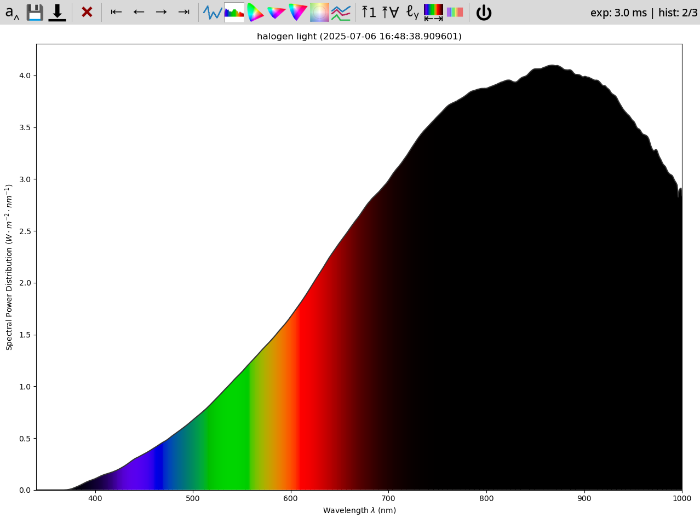
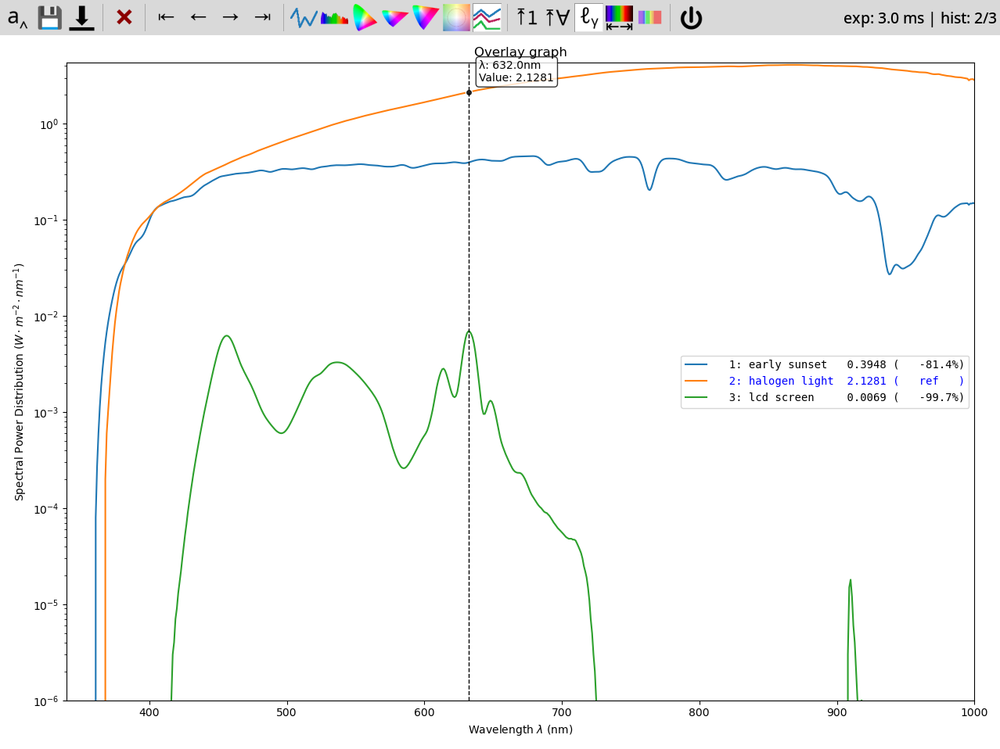

# tobes-ui: Torch Bearer Spectrometer UI

This is a UI for [Torch Bearer](https://www.torchbearer.tech/)
Spectrometer (`Y21B7W10034CCPD`) that is available on Amazon
and AliExpress ([TB Store](https://www.aliexpress.com/store/1104401209)).

Forked from [ZoidTechnology/Torch-Bearer-Tools](https://github.com/ZoidTechnology/Torch-Bearer-Tools)[^1]
and improved (beyond recognition?).

## Requirements

- Python 3.10
- `pip install colour-science matplotlib pyserial`

## Usage

```
$ python3 main.py -h
usage: main.py [-h] [-e EXPOSURE] [-q | -t GRAPH_TYPE] [-o | -n] [-f FILE_TEMPLATE]
               [-d [DATA ...]] [-s HISTORY_SIZE] [-l LOG_LEVEL] [--log-file LOG_FILE]
               [input_device]

TorchBearer spectrometer tool

positional arguments:
  input_device          Spectrometer device (/dev/ttyUSB0)

options:
  -h, --help            show this help message and exit
  -e EXPOSURE, --exposure EXPOSURE
                        Exposure time in milliseconds (0.1-5000) or 'auto' (default: auto)
  -q, --quick-graph     Enable quick (LINE) graph mode
  -t GRAPH_TYPE, --graph_type GRAPH_TYPE
                        Graph type (LINE, SPECTRUM, CIE1931, CIE1960UCS, CIE1976UCS, TM30,
                        OVERLAY) (default SPECTRUM)
  -o, --oneshot         One shot mode (single good capture)
  -n, --no-refresh      Start without refresh
  -f FILE_TEMPLATE, --file_template FILE_TEMPLATE
                        File template (without .ext) for data export (default:
                        'spectrum-{timestamp_full}{graph_type}'),
                        '{name}-{timestamp_full}{graph_type}' might be also useful
  -d [DATA ...], --data [DATA ...]
                        JSON dump file(s) to load for viewing (disables data refresh)
  -s HISTORY_SIZE, --history-size HISTORY_SIZE
                        Size of the measurement history (default: 50)
  -l LOG_LEVEL, --log-level LOG_LEVEL
                        Logging level to configure: {", ".join(e.name for e in LogLevel}
                        (default WARN)
  --log-file LOG_FILE   Logfile to write to (defaults to none (=console))
```

My typical use is:

``` sh
# To gather new data
python3 main.py /dev/ttyUSB0 -e auto -o

# To "replay" existing samples:
python3 main.py -d examples/*.json
```

The first invocation gives one-shot spectrum on auto exposure (from `/dev/ttyUSB0`):


Or, if you prefer, [screenshot of the CIE1976UCS locus](pictures/oneshot-cie1976ucs.png)
or [screenshot of the TM30 graph](pictures/oneshot-tm30.png).

The second invocation shows you replay of examples (no spectrometer needed!):





There are several icons on the toolbar:

| Icon | Key | Explanation |
|:---|:---:|:---|
|  | `Enter`, `A` | Name the current spectrum data |
|  | `S` | Saves rendered graph as png |
|  | `D` | Save raw data as json |
|  | `R` | Keep refreshing data |
|  | `1`, `O` | One good acquisition |
|  | `Delete`, `X` | Remove the current spectrum data _(from UI)_ |
|  | `Home`, `H` | Go to start of history |
|  | `←`, `P` | Go to previous sample |
|  | `→`, `N` | Go to next sample |
|  | `End`, `E` | Go to end of history |
|  | `Q`, `L` | Line graph |
|  | `C` | Spectrum graph _(slow to draw)_ |
|  | `3` | CIE1931 locus graph |
|  | `6` | CIE1960UCS locus graph |
|  | `7` | CIE1976UCS locus graph |
|  | `T` | TM30 graph |
|  | `V` | Overlay graph -- all spectra at once |
|  | `Y` | Only line+spectrum: Fix Y-axis range based on current graph |
|  | `G` | Only line+spectrum: Fix Y-axis range based on all graphs |
|  | `K` | Only line+overlay: Use logarithmic Y-axis |
|  | `Z` | Only line, spectrum, overlay: Limit X axis to visible spectrum (380..750 nm)|
|  | `\|` | Only line, overlay: Show spectrum + photosensitivities overlay |
|  | `Esc`, `Ctrl+Q` | Quit the app |

## Exported data

Sample exported data:

``` json
{
    "status": "normal",
    "exposure": "automatic",
    "time": 329.1,
    "spd": {
        "340": 0.0,
        "341": 0.0,
        "...": "......",
        "595": 0.013011,
        "596": 0.013095,
        "597": 0.013176,
        "598": 0.013251,
        "599": 0.013318,
        "600": 0.013385,
        "601": 0.01345,
        "602": 0.013515,
        "603": 0.013575,
        "604": 0.013621,
        "605": 0.013648,
        "...": "......",
        "995": 0.005143,
        "996": 0.005075,
        "997": 0.005119,
        "998": 0.004982,
        "999": 0.004944,
        "1000": 0.004859
    },
    "wavelength_range": [
        340,
        1000
    ],
    "spd_raw": [
        0.0,
        0.0,
        "......",
        0.013011,
        0.013095,
        0.013176,
        0.013251,
        0.013318,
        0.013385,
        0.01345,
        0.013515,
        0.013575,
        0.013621,
        0.013648,
        "......",
        0.005143,
        0.005075,
        0.005119,
        0.004982,
        0.004944,
        0.004859
    ],
    "ts": 1751704901.025932,
    "name": "my fancy spectrum"
}
```

## License

GPLv3

[^1]: Discussed in the [Software Hacks Unlock Cheap
Spectrometer](https://hackaday.com/2025/03/31/software-hacks-unlock-cheap-spectrometer/)
article.
